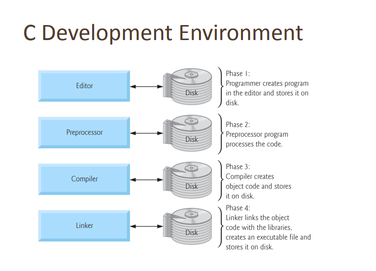
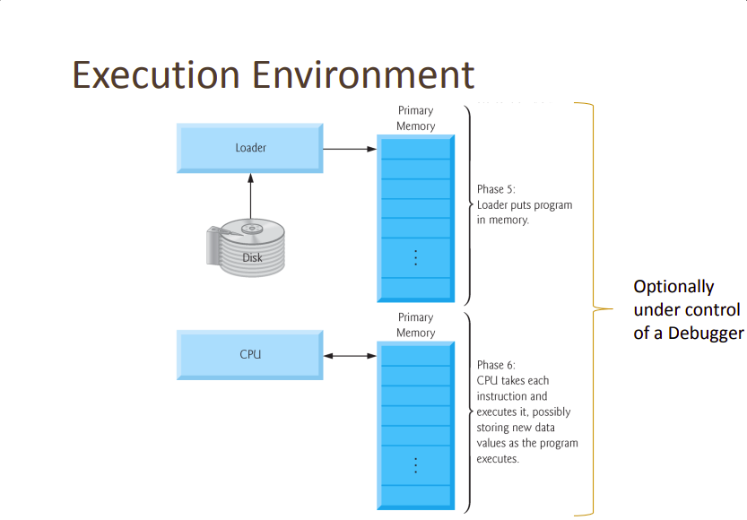

### Getting Started

<br/>

First C program  [click here](hello.c)

<br/>

 ```c
    #include<stdio.h>
    int main()
    {
        printf("Hello World");
        return 0;
    }

 ```

 ### Compilation process in c
 --- 
 The compilation is a process of converting the source code into object code.<br/> 
 It is done with the help of the compiler. The compiler checks the source code for the syntactical or structural errors, and if the source code is error-free, then it generates the object code.
<br/>
<br/>
C Development Environment| C Execution Environment
:-----------------------:|:-----------------------:
|

