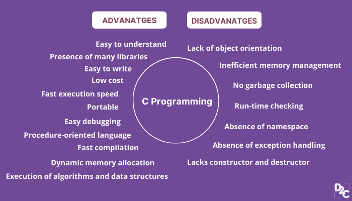
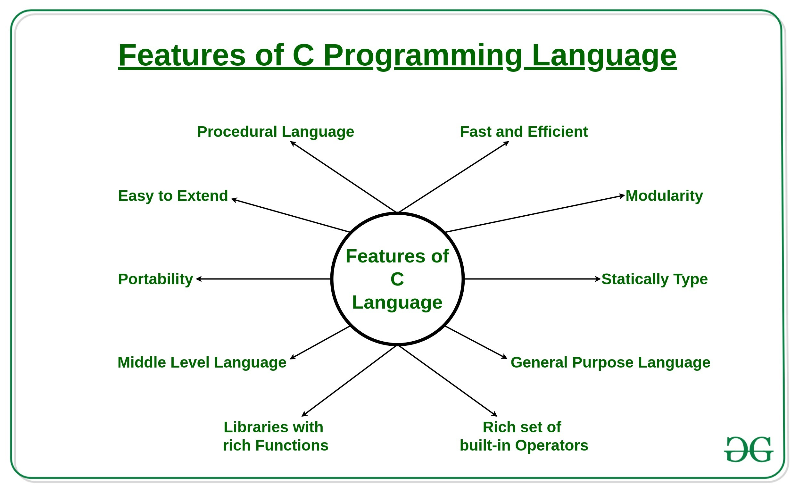

# Introduction to C

### What is a Language ?
- Language is a mode of communication that is used to share ideas, opinions with each other.

For example, if we want to teach someone, we need a language that is understandable by both communicators.

### What is Programming Language ?

A programming language is a computer language that is used by programmers (developers) to communicate with computers. It is a set of instructions written in any specific language ( C, C++, Java, Python) to perform a specific task.

### Types of programming language
- **Low-level programming language** 
Low-level language is machine-dependent (0s and 1s) programming language.\
The processor runs low- level programs directly without the need of a compiler or interpreter, so the programs written in low-level language can be run very fast.\
It is further divided into 2 parts:  Machine Language and Assembly Language

- **High-level programming language**
High-level programming language (HLL) is designed for developing user-friendly software programs and websites.\
This programming language requires a compiler or interpreter to translate the program into machine language.\
It is further divided into 2 parts: Procedural Oriented Programming and Object Oriented Programming.
 
## History of Programming 
The root of all modern languages is ALGOL (introduced in 1960s).

ALGOL used as a structure programming language.

Then, in 1967 Martin Richards developed a language called BCPL (Basic Combined Programming Language).

In 1970 Ken Thompson created a language using BCPL features called simply B.

Both BCPL and B were "typeless" languages.

## History of C
C was evolved from ALGOL, BCPL and B.

C was developed by Dennis Ritchie at the Bell Laboratories in 1972

Added new features and concepts like “data types”.

It was developed along with the UNIX operating system.

 It was strongly integrated with the UNIX operating system.

It was strongly integrated with UNIX OS because that time Ken Thompson was working on UNIX and they developed the C language to be very compatible with C. 

## Features Of C -lang :

 

## Advantages and Disadvantages :
  

## What is an IDE ?

An integrated development environment (IDE) is software for building applications that combines common developer tools into a single graphical user interface (GUI).

***An IDE typically consists of :***
- Source code editor
- Debugger
- Local Build Automation (Compiler and Execution)

### Some famous IDE examples for C :
Click on the following to download.
- [Dev C++](https://link-url-here.org)
- [Code Block](https://link-url-here.org)

### How does computer understand programming language ?
Compliers and interpreters are programs that help convert the high level language (Source Code) into machine codes to be understood by the computers. Computer programs are usually written on high level languages.

### Differences between Interpreter and Compiler :

---

Interpreter             |  Compiler
:-------------------------:|:-------------------------:
Interpreter translates just one statement of the program at a time into machine code |A compiler takes a lot of time to analyze the source code. However, the overall time taken to execute the process is much faster.
An interpreter takes very less time to analyze the source code. However, the overall time to execute the process is much slower.|  Compiler scans the entire program and translates the whole of it into machine code at once.
Interpreters are used by programming languages like Ruby and Python for example.|Compliers are used by programming languages like C and C++ for example

### Getting Started

First C program  [click here](hello.c)
